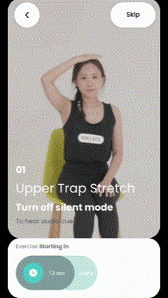

# Kimia Deskercise [Android]: SDK Integration Guide
This SDK can be integrated into Android applications to administer desk-based exercises, targeted at office workers


## Table of Contents
1. [Features](#Features) 
2. [Installation](#Installation)  
    1. [Requirement](#Requirements)  
    2. [Configuration](#Configuration)  
3. [Getting Started](#getting-started)
    1. [Integration](#integration)
    2. [Examples](#examples)


## Features
Desk-based Exercises

Deskercise provides 3 exercise models for users to choose from, depending on the amount of time the user has for their workout

|                             | Exercise Program Models 

(Numbers indicate order of exercises) |
| --------------------------- | --------------------------------------------------------------- |
| Exercise Name               | Exercise ID                                                     | 5 min | 10 min | 15 min |
| Upper Trap Stretch          | 11                                                              | ✔ (1) | ✔ (1) | ✔ (1) |
| Shoulder Shrug Stretch      | 8                                                               |  | ✔ (2) | ✔ (2) |
| Neck Stretch                | 6                                                               |  | ✔ (3) | ✔ (3) |
| Torso Stretch               | 7                                                               | ✔ (3) | ✔ (4) | ✔ (4) |
| Overhead Shoulder Stretch   | 3                                                               |  | ✔ (5) | ✔ (5) |
| Side Stretch                | 4                                                               | ✔ (2) | ✔ (6) | ✔ (6) |
| Piriformis Stretch          | 12                                                              |  |  | ✔ (7) |
| Overhead Tricep Stretch     | 2                                                               |  |  | ✔ (8) |
| Horizontal Shoulder Stretch | 13                                                              |  |  | ✔ (9) |
| Relaxation Breathing        | 14                                                              | ✔ (4) | ✔ (7) | ✔ (10) |

After the user selects the Exercise Program Model, the SDK will utilise a joint-detection machine-learning model to guide the user through the selected exercises.




## Installation

### Requirements
- Android 6.0 (API level 23) and above
- Java JDK 1.8+
- Android Gradle Plugin 8.1.0+
- Gradle 8.1-rc-2+

### Configuration
Step 1: Add `mavenCentral()` to your list of repositories in your project-level `build.gradle` file

```kotlin
buildscript {
    repositories {
        mavenCentral()
    }
}
```

Step 2: Add `move-sdk` to your app-level `build-gradle` dependencies

```
dependencies {
    implementation 'com.kinexcs:move-sdk:<version>'
}
```

## Getting Started

### Integration

**Initialization**<br>
Step 1: In your `AndroidManifest.xml`, insert the `package-name` and `key` provided to you under `<meta-data>` in the `<application>` level. These will be provided to you separately to ensure SDK integrity.

```
<application>
    <meta-data>
        android:name='<<package-name>>'
        android:value='<<key>>'
    </meta-data>
</application>
```

Step 2: Initialize the SDK at the application level.

```kotlin
class MyApplication : Application() {
    override fun onCreate() {
        super.onCreate()
        MoveSDK.init(this)
    }
}
```

**Exercise Program Models**<br>
1. To run the Exercise Program Models in your app, first declare an instance of MoveSDK

```kotlin
val moveSDK = MoveSDK()
```

2. MoveSDK provides three Exercise Program Models as an Intent object for use. These are:

```kotlin
// 5 minutes model
moveSDK.getIntent5Minutes(activity: Activity, isRandom: Boolean = false)
// 10 minutes model
moveSDK.getIntent10Minutes(activity: Activity, isRandom: Boolean = false)
// 15 minutes model
moveSDK.getIntent15Minutes(activity: Activity, isRandom: Boolean = false)
```

You can refer to [Features](#features) to check out the Exercises under each Program Model.

If `isRandom == true`, then the selection and order of the exercises will be randomised on each run (with the exception of Relaxation Breathing, which will always be the last exercise).

If `isRandom == false`, then the order of the exercises will be as shown in [Features](#features)

3. In your `Activity` or `Fragment` class, prepare an `ActivityResultLauncher` using the companion object `MoveSDK.handleResult()` as follows:

```kotlin
private val launcher =
   registerForActivityResult(ActivityResultContracts.StartActivityForResult()) { r ->
      val result = MoveSDK.handleResult(r.resultCode, r.data)
      result.exception?.let {
          // handle any error messages and exceptions here
          Toast.makeText(this, it.message.orEmpty(), Toast.LENGTH_SHORT).show()
      }
      result.detail?.let { detail: SessionDetail ->
          // Returns a SessionDetail object
          // Handle the results of your workout here
          myViewModel.receiveResults(detail)
      }
   }
```

`SessionDetail` is a `data class` storing the full results of one exercise session. Its attributes are as follows:
- `sessionId : String` \t An autonumber to uniquely identify each exercise session carried out
- `programId : Int` \t An ID to identify the program models chosen. 
  - `programId = 1` represents a 5 min program model
  - `programId = 2` represents a 10 min program model
  - `programId = 3` represents a 15 min program model
- `createdAt : String` \t The timestamp when the exercise session is first created. This time is recorded when the `Intent` is launched by the user
- `exercises : List<Exercise>`

`Exercise` is another `data class` storing the full results of one single exercise in an exercise session. Its attributes are as follows:
- `exerciseId : Int` \t The unique identifier for each exercise. Refer to [Features](#features) for the name corresponding to the ID number
- `countGood : Int` \t The number of good repetitions for that exercise
- `countBad : Int` \t The number of bad repetitions for that exercise
- `completedReps : Int` \t The number of repetitions completed for that exercise. If the exercise if not Skipped in the middle, then this number will be equal to `totalReps`
- `totalReps : Int` \t The number of repetitions for that exercise if it was not Skipped in the middle

4. Launch the `Intent` selected in Step 2 to start the exercise.

```kotlin
launcher.launch(moveSDK.getIntent5Minutes(this, true))
```

## Examples
Refer to https://github.com/kinexcs/move-android-sdk for a sample app running this SDK